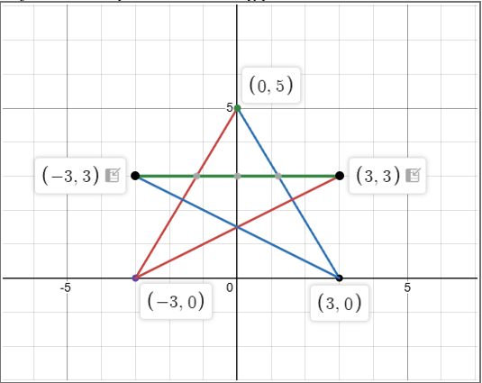
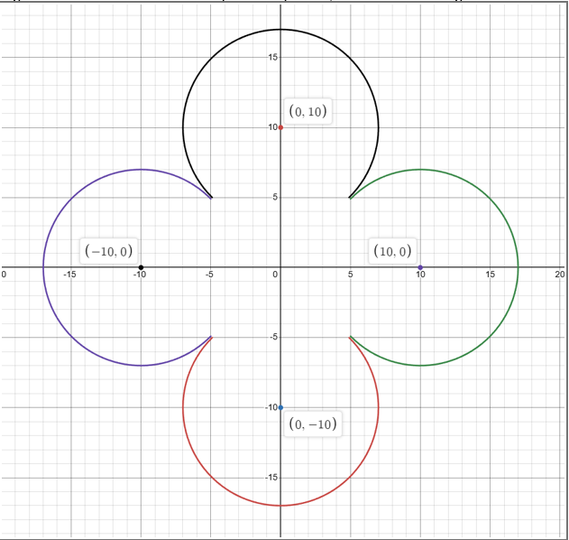
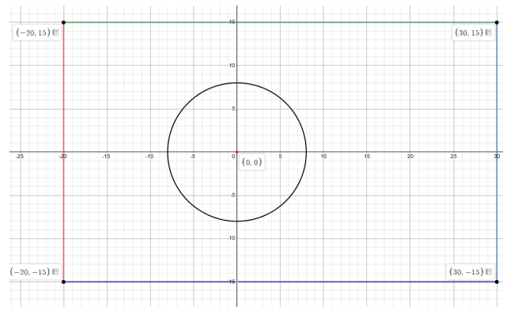

# Computer Graphics Lab

A collection of lab tasks covering core computer graphics concepts including line/circle drawing algorithms, region filling, waveform generation, and object transformations using OpenGL/GLUT.

---

## Table of Contents

- [Lab 1A – Star Draw](#lab-1a--star-draw)
- [Lab 1B – Flower Draw](#lab-1b--flower-draw)
- [Lab 2A – National Flag](#lab-2a--national-flag)
- [Lab 2B – Waveform](#lab-2b--waveform)
- [Lab 3A – Save the Red Ball](#lab-3a--save-the-red-ball)
- [Lab 3B – Ball and Paddle Game](#lab-3b--ball-and-paddle-game)
- [Group 0 – Scaling on Translation](#group-0--scaling-on-translation)
- [Group 1 – Automatic Working Clock](#group-1--automatic-working-clock)
- [Group 2 – Mirror a Circle and Rotate](#group-2--mirror-a-circle-and-rotate)
- [Group 3 – Moving Triangle](#group-3--moving-triangle)

---

## Lab 1A – Star Draw



**Topic:** Scan-converting line segments using the Bresenham line drawing algorithm.

A figure composed of multiple line segments is drawn, each plotted separately using Bresenham's algorithm. The figure should be maximized and not distorted.

**Key Concepts:**
- Bresenham line drawing for slopes in all octants
- Mirroring technique: lines with slopes outside `0 < m < 1` are mirrored into the base range, scan-converted, then reverse-transformed
  - `−1 < m < 0`: mirror horizontally (negate y-coordinates)
  - `m > 1`: swap x and y coordinates before and after scan-conversion
- Alternative for `|m| > 1`: derive Bresenham expressions using `y_{i+1} = y_i + 1` and solving for `x_{i+1}` recursively

---

## Lab 1B – Flower Draw



**Topic:** Drawing arcs using the Bresenham circle drawing algorithm.

A figure composed of multiple arcs is generated. Each arc is plotted separately to form the complete figure. The output should be maximized and not distorted.

**Key Concepts:**
- Standard Bresenham circle algorithm for one quadrant
- Apply symmetry transformations to generate arcs in all four quadrants from a single quadrant's output

---

## Lab 2A – National Flag



**Topic:** Region filling / flood fill using mouse click as the seed point (like Paint in Windows).

The Bangladeshi national flag is pre-drawn with defined coordinates. Clicking in different regions fills them with the correct color:

| Click Location | Result |
|---|---|
| Outside the flag | Nothing happens |
| Inside rectangle, outside circle | Fills rectangle **green** (excluding the circle) |
| Inside the circle | Fills circle **red** |

**Key Concepts:**
- Region filling using BFS or DFS graph traversal
- Seed = mouse pointer coordinates at click time (`glutMouseFunc`)
- Region can be treated as boundary-defined or interior-defined as needed

---

## Lab 2B – Waveform

**Topic:** Generating a ripple/waveform visualization by clicking in the window.

Clicking inside the window uses the click coordinates as a seed and performs BFS to color every pixel. The color at each point is determined by its distance from the click, producing a waveform-like ripple pattern.

**Color Function:**
```
color(x, y) = RGB(0, 0, 0.1 + 0.9 * |sin(dis(x, y))|)
```
where `dis(x, y)` is the Euclidean distance from the seed point to `(x, y)`.

**BFS Algorithm (8-connected):**
```
BFS(seed_x, seed_y):
  vis[seed_x][seed_y] = true
  dis[seed_x][seed_y] = 0
  color(seed_x, seed_y)
  queue q
  q.push({seed_x, seed_y})
  while (!q.empty()):
    frnt = q.front(); q.pop()
    for all 8-adjacent neighbors of frnt:
      if !vis[adj] && adj is within window:
        q.push(adj)
        vis[adj] = true
        dis[adj] = dis[frnt] + 1
        color(adj)
```

**Key Concepts:**
- `glutMouseFunc` to capture click coordinates
- BFS-based flood fill over the entire window
- Distance-based color mapping (deep blue = high amplitude, light blue = low amplitude)
- Equal units on both axes

---

## Lab 3A – Save the Red Ball

**Topic:** Object transformations using user-built transformation functions.

A simple survival game where the objective is to keep the red ball safe from a bouncing blue ball.

**Setup:**
- Red ball radius: `R`
- Blue ball radius: `R / 5`
- Window size: at least `10R × 10R`

**Red Ball (Player-controlled):**
- Moves with **arrow keys** (UP / DOWN / LEFT / RIGHT)
- Does **not** rebound at walls — it stops at the boundary

**Blue Ball (Automatic):**
- Starts at a random position with a random initial velocity `V = vₐî + v_bĵ`
- Velocity range: slow enough to cross the screen in **≤ 4 seconds**, fast enough to cross in **≥ 2 seconds**
- Rebounds off all four walls automatically

**Objective:**
- Avoid collisions between the red ball and the blue ball for as long as possible.
- The game ends when the blue ball touches the red ball.

> ⚠️ Build all transformation functions from scratch — do not use built-in transformation utilities.

---

## Lab 3B – Ball and Paddle Game

**Topic:** Object transformations using user-built transformation functions.

A classic paddle-and-ball game. Keep the ball in play by bouncing it with the paddle.

**Setup:**
- Paddle length: between `1/10` and `1/8` of screen width
- Ball radius: `1/30` of screen height
- Paddle position: fixed horizontal line at `1/20` of screen height from the bottom

**Paddle (Player-controlled):**
- Moves **LEFT** or **RIGHT** with arrow keys along the fixed horizontal line

**Ball (Automatic):**
- Starts at rest on the paddle
- Press **UP** to launch the ball and start the game
- Initial random velocity `V = vₓî + v_yĵ` — minimum speed crosses the screen within **2 seconds**
- Rebounds off the **top**, **left**, **right** walls and the **paddle**
- **Game over** when the ball touches the bottom of the screen

**Objective:**
- Keep the ball from touching the bottom of the screen by moving the paddle.
- Survive as long as possible by continuously bouncing the ball.

> ⚠️ Build all transformation functions from scratch — do not use built-in transformation utilities.

---

## Group 0 – Scaling on Translation

**Topic:** Combining translation and scaling transformations.

A rectangle moves horizontally across the screen. The size of the rectangle changes according to its movement direction.

**Controls:**

| Key | Action |
|---|---|
| ← LEFT ARROW | Move the rectangle to the left and scale down |
| → RIGHT ARROW | Move the rectangle to the right and scale up |

> ⚠️ Transformation operations are implemented manually without relying on built-in transformation utilities.

---

## Group 1 – Automatic Working Clock

**Topic:** Rotation transformation and real-time animation.

A fully functional analog clock with three moving arms representing the second, minute, and hour hands. The clock runs automatically and updates the positions of all hands in real time without requiring any user interaction.

---

## Group 2 – Mirror a Circle and Rotate

**Topic:** Reflection and rotation transformations.

A circle is placed in front of a mirror, creating its reflected image behind the mirror. The mirror can rotate around the original circle, and the reflected circle moves accordingly. The mirror can also be moved closer to or farther from the circle.

**Controls:**

| Key | Action |
|---|---|
| A | Rotate the mirror to the left |
| D | Rotate the mirror to the right |
| ← LEFT ARROW | Move the mirror closer to the circle |
| → RIGHT ARROW | Move the mirror farther from the circle |

---

## Group 3 – Moving Triangle

**Topic:** Rotation and translation based on object orientation.

A triangle with vertices `(-3, 0)`, `(3, 0),` and `(0, 5)` initially faces upward. Before moving in any direction, the triangle first rotates to face that direction. Pressing the same direction key again moves the triangle in that direction.

**Controls:**

| Key | Action |
|---|---|
| ↑ UP ARROW | Face upward or move upward |
| ↓ DOWN ARROW | Face downward or move downward |
| ← LEFT ARROW | Face left or move left |
| → RIGHT ARROW | Face right or move right |

---

## Technologies Used

- **Language:** C/C++
- **Graphics API:** OpenGL with GLUT

---

## Getting Started

1. Make sure OpenGL and GLUT are installed on your system.
2. Compile the desired lab file, for example:
   ```bash
   g++ lab1a.cpp -o lab1a -lGL -lGLU -lglut
   ./lab1a
   ```
3. Follow the interaction instructions for each lab (mouse clicks, arrow keys, etc.).
